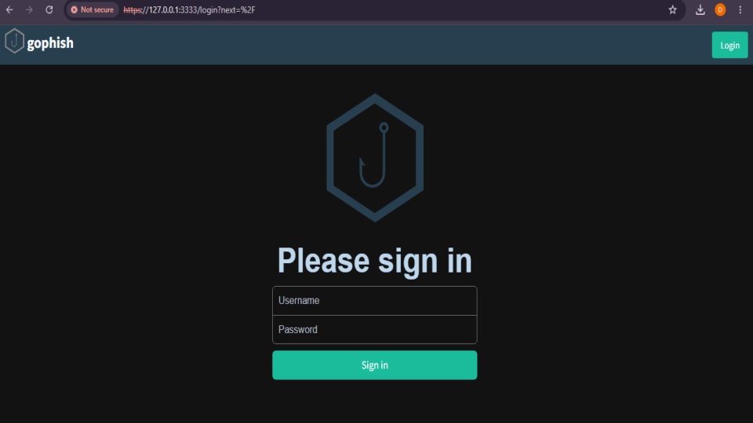
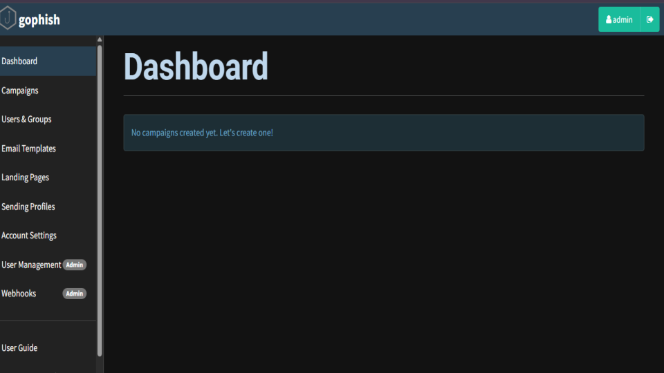
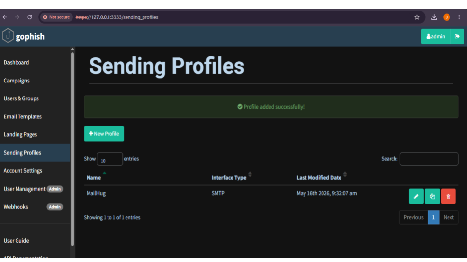
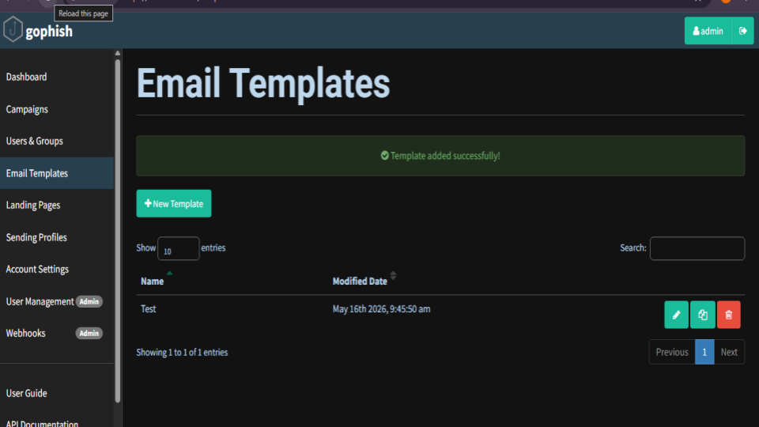
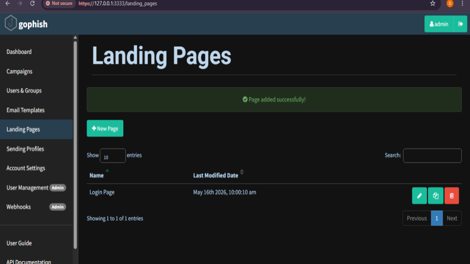
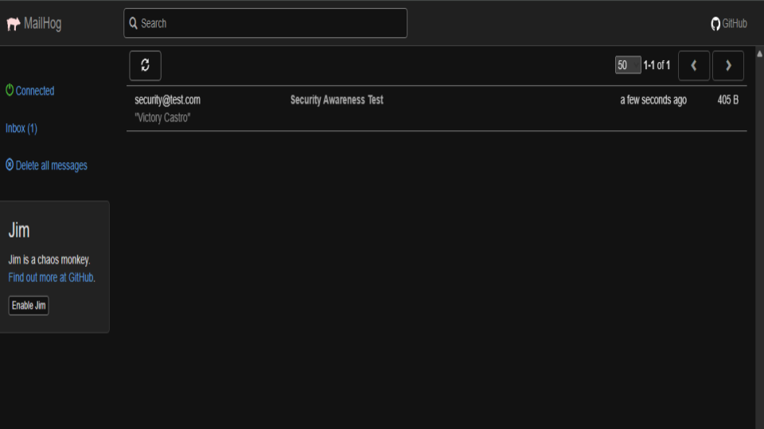
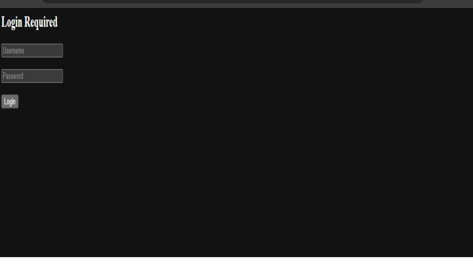
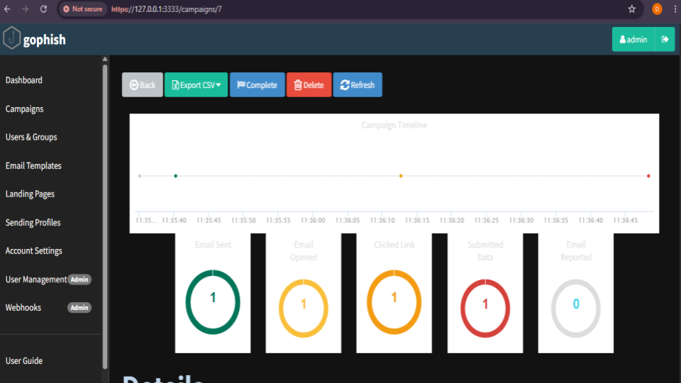
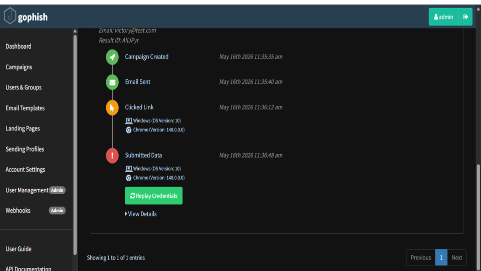

# Phishing Awareness Lab with Gophish

## 📌 Project Overview
This project demonstrates a controlled phishing awareness simulation using Gophish and MailHog within a local lab environment. The objective was to understand how phishing campaigns operate, how credentials are harvested, and how security teams can monitor and respond to phishing-related events.

The lab was designed strictly for educational and defensive cybersecurity purposes, focusing on user awareness, phishing detection, and security monitoring workflows commonly encountered in SOC environments.


## 🎯 Objectives
- Configure and deploy Gophish locally
- Create phishing email templates
- Build a custom credential capture landing page
- Simulate phishing email delivery using MailHog
- Track user interactions and phishing events
- Capture submitted credentials in a safe testing environment
- Analyze phishing campaign telemetry

# 🛠 Tools & Technologies Used

## Security Tools
- Gophish
- MailHog

## Technologies
- HTML
- Localhost Networking
- Windows 10

## Concepts Practiced
- Phishing Simulation
- Credential Harvesting Awareness
- Social Engineering Concepts
- Email Campaign Tracking
- User Interaction Monitoring
- Security Awareness Training

# 🧪 Lab Environment

| Component | Purpose |
|---|---|
| Gophish | Phishing framework for campaign management |
| MailHog | Local email testing server |
| Localhost (127.0.0.1) | Safe local testing environment |
| Browser Testing | Victim simulation and event tracking |

# ⚙️ Project Workflow

## 1️⃣ Gophish Configuration
Configured the Gophish admin server and phishing server locally using custom configuration settings.

### Key Configurations
- Admin Interface: `127.0.0.1:3333`
- Phishing Server: `0.0.0.0:8080`
- Local Testing Environment Enabled

## 2️⃣ Email Template Creation
Created a phishing awareness email template containing:
- Security verification message
- Embedded tracking link
- HTML formatting

### Sample Template
```html
<h2>Security Awareness Training</h2>

<p>Your account requires verification.</p>

<a href="{{.URL}}">
Click here to verify your account
</a>
```

## 3️⃣ Landing Page Development
Built a custom phishing landing page with:
- Username field
- Password field
- Credential capture enabled
- Redirect configuration

### Landing Page HTML
```html
<html>
<head></head>
<body>

<h2>Login Required</h2>

<form action="" method="POST">

<input type="text" name="username" placeholder="Username"/><br><br>

<input type="password" name="password" placeholder="Password"/><br><br>

<button type="submit">Login</button>

</form>

</body>
</html>
```


## 5️⃣ Credential Capture & Tracking
Successfully simulated:
- Email delivery
- Email open events
- Link clicks
- Credential submission

Captured telemetry included:
- Browser information
- Operating system details
- Timestamps of phishing events
- Submitted username and password values

# 📊 Results

## Successful Campaign Events
✅ Email Sent  
✅ Email Opened  
✅ Link Clicked  
✅ Credentials Submitted  

### Captured Information
- Username
- Password
- Browser Version
- Operating System
- Event Timeline

# 🔐 Security Lessons Learned

This project demonstrates how attackers can:
- Create convincing phishing emails
- Build fake authentication portals
- Harvest credentials
- Track victim interactions

It also highlights the importance of:
- Security awareness training
- Email verification practices
- User education
- Phishing detection mechanisms
- Defensive monitoring in SOC environments

### 📊 Evidence 

<h3 align="center">This screenshot displays the Gophish authentication page used to access the phishing simulation dashboard</h3>

<p align="center">
    
</p>

<h3 align="center">The main Gophish dashboard showing the centralized management interface for phishing awareness campaigns</h3>

<p align="center">
    
</p>

<h3 align="center">This screenshot shows the SMTP sending profile configuration in Gophish. The MailHog SMTP server was integrated to simulate phishing email delivery during testing.
</h3>

<p align="center">
    
</p>

<h3 align="center">A phishing email template was created to simulate a security awareness email requesting account verification</h3>

<p align="center">
    
</p>

<h3 align="center">A custom phishing landing page was created to simulate a fake login portal</h3>

<p align="center">
    
</p>

<h3 align="center">The phishing awareness email successfully arrived in the MailHog inbox</h3>

<p align="center">
    
</p>

<h3 align="center">The phishing landing page presented to the victim after clicking the malicious email link</h3>

<p align="center">
    
</p>

<h3 align="center">Campaign statistics showing user interaction metrics including email delivery, email opens, link clicks, and submitted credentials</h3>

<p align="center">
    
</p>

<h3 align="center">Detailed campaign timeline showing the phishing lifecycle events including email delivery, link clicks, and credential submission</h3>

<p align="center">
    
</p>

All screenshots are here:

🔗 [Google Slides ](https://docs.google.com/presentation/d/1lk3u8WPpmoGJc-9YRblUvh6bbO4Cw8vspJd2P7kCvco/edit?usp=sharing)


# ⚠️ Disclaimer
This project was conducted strictly within a local and controlled lab environment for educational and defensive cybersecurity purposes only.

No real users, public infrastructure, or unauthorized systems were targeted.

# 👨‍💻 Author
## Idama Victory Othuke
